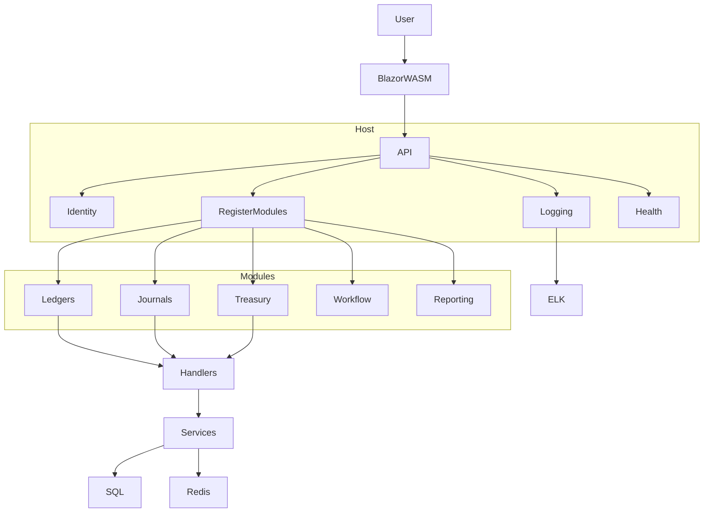

# Accounting Architecture v0 (AI-Optimized Specification)

> Version: 0.1
> Architecture Style: Modular Monolith + Vertical Slice
> Status: MVP Approved
> AI Agents: MUST FOLLOW ALL RULES DEFINED IN THIS DOCUMENT

Mandatory security policy reference:

* `docs/architecture/security-implementation-review-rules.md`

---

# 1. System Overview

Accounting v0 is a modular financial system built using:

* .NET (Backend)
* Blazor WebAssembly (Frontend)
* SQL Server (Primary Database)
* Redis (Caching Layer)
* CQRS with Handlers
* Minimal API
* Duende IdentityServer + Microsoft Identity
* Serilog + ELK
* Health Checks + Metrics Monitoring

The system is designed as:

> Modular Monolith (MVP) with future migration path to SoA.

---

# 2. Architectural Constraints (MANDATORY)

AI Agents MUST respect these constraints:

1. No shared business domain between modules.
2. Only a minimal SharedKernel is allowed.
3. Endpoints MUST be defined inside modules.
4. Host MUST only register modules.
5. Cross-module direct database joins are NOT allowed.
6. Business logic MUST NOT be placed in CQRS handlers.
7. Handlers MUST be thin orchestrators.
8. SQL Server is the primary source of truth.
9. Redis is cache only (never authoritative).
10. Observability is mandatory (logs + metrics + health).

---

# 3. High-Level Architecture



---

# 4. Solution Structure

Target structure:

```
/src
  Accounting.Api                ← Host (Composition Root)
  Accounting.Blazor             ← Frontend
  Accounting.SharedKernel       ← Minimal Shared Types
  /Frameworks
    /Accounting.Frameworks      ← Shared cross-cutting patterns (Result/Option)

  /Modules
    /Ledgers
    /Journals
    /Treasury
    /Workflow
    /Reporting
    /IdentityAccess
```

Current workspace mapping (`projects/Accounting-Project/src`):

```
/src
  Accounting.Api
  Accounting.Blazor
  Accounting.SharedKernel
  Frameworks

  /Modules
    /GeneralLedger
      /Domain
      /Handlers
      /Features
      /Infrastructure
      /Services
    /Treasury
      /Domain
      /Handlers
      /Features
      /Infrastructure
      /Services
    /SystemSettings
      /Domain
      /Handlers
      /Features
      /Infrastructure
      /Services
    /IdentityServer
      /Accounting.Modules.Idp
        /Domains
        /Handlers
        /Infrastructures
        /Migrations
        /Services
```

Note:

* Target module names and current implementation names may differ while convergence is in progress.
* All implementations must still follow module boundary, facade handler style, and no cross-module DB coupling rules.

---

# 5. Shared Kernel Rules

SharedKernel MAY contain:

* EntityId
* Result
* Error
* BaseEntity
* AggregateRoot (technical only)
* DomainEvent (technical only)

SharedKernel MUST NOT contain:

* Ledger
* Journal
* Treasury
* Business Rules
* Cross-module abstractions

SharedKernel must remain stable and small.

---

# 6. Module Design Rules

Each module:

* Owns its Domain
* Owns its Database tables
* Defines its own Endpoints
* Implements Vertical Slice architecture

### Example Module Structure

```
Modules/Ledgers
  /Commons
    /Helpers
    /Extensions
  /Handlers
  /Domain
    /Ledger
      /Entities
      /Enums
      /Aggregates
      /Contracts
  /Features
    /CreateLedger
    /GetLedgers
  /Infrastructure
    /Contexts
    /Repositories
  /Services
  Module.cs
```

Domain and commons rules (mandatory):

* Domain must be organized by entity root: `Domain/<EntityName>/Entities|Enums|Aggregates|Contracts`.
* Every module must include `Commons/Helpers` and `Commons/Extensions` for module-local shared code.
* Every module must include `Handlers` for handlers and `Infrastructure/Repositories` for persistence implementations.
* DbContext classes must be placed under `Infrastructure/Contexts`.

Rich domain construction rules (mandatory):

* Use rich domain behavior in entity methods where invariants belong.
* Use Builder and/or Factory for non-trivial aggregate construction.
* Split entity implementation into partial files where applicable:
  * `<Entity>.cs` (core state)
  * `<Entity>.Behavior.cs` (rich domain rules/invariants)
  * `<Entity>.Construction.cs` (builder/factory paths)

---

# 7. Endpoint Strategy

### Rule

Endpoints MUST be defined inside the module.

Host MUST only register them.

### Example

Inside module:

```csharp
public static class LedgersModule
{
    public static IServiceCollection AddLedgersModule(...)
    public static IEndpointRouteBuilder MapLedgersEndpoints(...)
}
```

Inside Host:

```csharp
builder.Services.AddLedgersModule();
app.MapLedgersEndpoints();
```

Host MUST NOT contain business routing logic.

---

# 8. CQRS Architecture

Pattern: CQRS + Handlers

## Handler Rules

Handlers MUST:

* Be thin facade/orchestrators for a use-case flow
* Inject independent services as needed
* Coordinate one or more service calls where needed
* Return response

Handlers MUST NOT:

* Contain complex business logic
* Execute complex SQL joins
* Contain domain rules
* Access repositories directly

## Business Logic Location

Business logic MUST live in:

* Domain layer
* Service layer

Mandatory processing chain:

* Minimal API endpoint -> Handler -> Service(s) -> Repository

Result Pattern (mandatory):

* Use shared Result abstractions from `src/Frameworks/Accounting.Frameworks` for command/query outcomes.
* Failure responses must include stable error code + localization key.
* Backend should not return translated text.

---

# 9. Database Architecture

Primary DB: SQL Server

## Rules

1. Each module owns its tables.

2. Cross-module joins are forbidden.

3. Reporting must use:

   * Dedicated query layer
   * Read models
   * Views / Dapper

4. Migrations must be module-scoped.

---

# 10. Redis Caching

Redis is used for:

* Lookup caching
* Permission caching
* Read query caching

Redis MUST NOT:

* Be source of truth
* Store transactional state

Cache keys MUST support versioning.

---

# 11. Optional NoSQL Usage

NoSQL MAY be introduced when:

* Read models become too complex
* Audit/event storage grows large
* Analytical workloads require it

NoSQL introduction requires architectural review.

---

# 12. Authentication & Authorization

Authentication:

* Duende IdentityServer
* Microsoft Identity

Authorization:

* Policy-based
* Role-based
* Scope-based (Company / FiscalYear / Office)
* Ownership-based (Document level)

All endpoints MUST require authentication.

Security enforcement note:

* Security implementation and review rules are mandatory and governed by `docs/architecture/security-implementation-review-rules.md`.
* PRs must include a negative-scoring security review.
* Any Critical security finding blocks merge/release.

---

# 13. Observability

## Logging

* Serilog
* Structured JSON logs
* CorrelationId required
* Logs forwarded to ELK

## Health Checks

Mandatory:

* API health
* SQL connectivity
* Redis connectivity
* Identity availability

## Metrics

Must include:

* Request latency
* Error rate
* SQL query duration
* Redis hit/miss ratio

---

# 14. Frontend Architecture

Frontend: Blazor WebAssembly (Hosted)

Rules:

* UI must call backend APIs only
* No direct database logic
* Token-based authentication
* API-first design

---

# 15. Migration Path to SoA

Future strategy:

* Extract high-change modules first:

  * Integration
  * Reporting
  * Workflow

Preconditions:

* Clear module boundaries
* No shared business domain
* Controlled data ownership

---

# 16. AI Development Guidelines

When AI Agent generates code:

1. Follow Vertical Slice pattern.
2. Keep handlers thin.
3. Place business logic in rich domain/services.
4. Never introduce shared domain entities.
5. Never introduce cross-module DB join.
6. Always include structured logging.
7. Include basic validation.
8. Enforce DRY (no duplicated logic).
9. Enforce SOLID (single responsibility, clear boundaries, low coupling).
10. Enforce KISS (prefer simple and clear implementations).
11. Apply DDD principles and domain language in modeling.
12. Keep method input parameters explicit, validated, and standardized.
13. Use modern C#/.NET features where they improve readability and maintainability.
14. Implement DTOs as `record` types.
15. Prefer primary constructors for dependency-focused classes.
16. Prefer one-line expression-bodied methods for simple single-line behavior.
17. Prefer `foreach` iteration when index access is not required.
18. Enforce EF read/write discipline (`AsNoTracking` for reads, tracked writes, no `SaveChangesAsync` in loops).
19. Return DTO/view models only; never expose EF entities from APIs.
20. Enforce pagination on all list queries (`Skip`/`Take`) and prefer compiled queries for hot paths.
21. Enforce financial data safety (`decimal` money types, UTC timestamps, transactions, concurrency tokens).
22. Keep controllers/endpoints routing-only and place business logic in services/domain.
23. Require explicit, index-friendly, and predictable database access.
24. Run heavy jobs in background workers.
25. Ensure generated code is production-grade for financial/ERP systems.
26. Enforce key-based localization for all user-facing text across backend and frontend contracts.
27. Use `src/Frameworks/Accounting.Frameworks` for shared Result/Option patterns.
28. Use Builder/Factory + partial entity split for rich domain construction where needed.

These rules apply to both AI code generation and AI code review.

---

# 17. Do / Don't Summary

## DO

* Keep modules isolated.
* Register endpoints inside modules.
* Use handlers as facade coordinators.
* Log everything structured.
* Maintain data ownership.
* Keep implementations DRY, SOLID, and KISS-compliant.
* Apply DDD language and boundaries.
* Keep method input design explicit and consistent.

## DO NOT

* Create shared business models.
* Put logic in handlers.
* Join tables across modules.
* Bypass services.
* Store transactional truth in Redis.
* Accept unclear or overlong method parameter lists without refactoring.

---

# 18. Final Architectural Identity

This system is:

* Modular
* API-first
* CQRS-based
* Handlers-facade based internally
* Cache-aware
* Observability-first
* AI-assisted development ready
