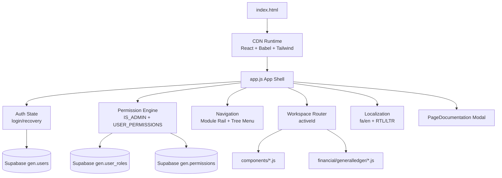
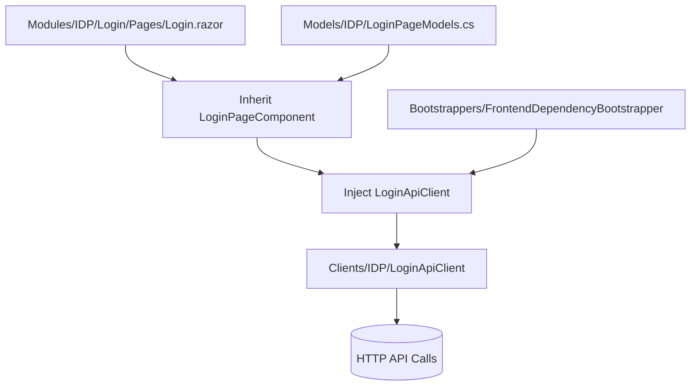

# Frontend Architecture Diagram

```mermaid
flowchart TD
  A[index.html] --> B[CDN Runtime\nReact + Babel + Tailwind]
  B --> C[app.js App Shell]

  C --> D[Auth State\nlogin/recovery]
  C --> E[Permission Engine\nIS_ADMIN + USER_PERMISSIONS]
  C --> F[Navigation\nModule Rail + Tree Menu]
  C --> G[Workspace Router\nactiveId]

  G --> H[components/*.js]
  G --> I[financial/generalledger/*.js]

  E --> J[(Supabase gen.user_roles)]
  E --> K[(Supabase gen.permissions)]
  D --> L[(Supabase gen.users)]

  C --> M[Localization\nfa/en + RTL/LTR]
  C --> N[PageDocumentation Modal]
```

```mermaid
flowchart TD
  A[Modules/IDP/Login/Pages/Login.razor] --> B[Inherit LoginPageComponent]
  B --> C[Inject LoginApiClient]
  C --> D[Clients/IDP/LoginApiClient]
  D --> E[(HTTP API Calls)]

  F[Models/IDP/LoginPageModels.cs] --> B
  G[Bootstrappers/FrontendDependencyBootstrapper] --> C
```
