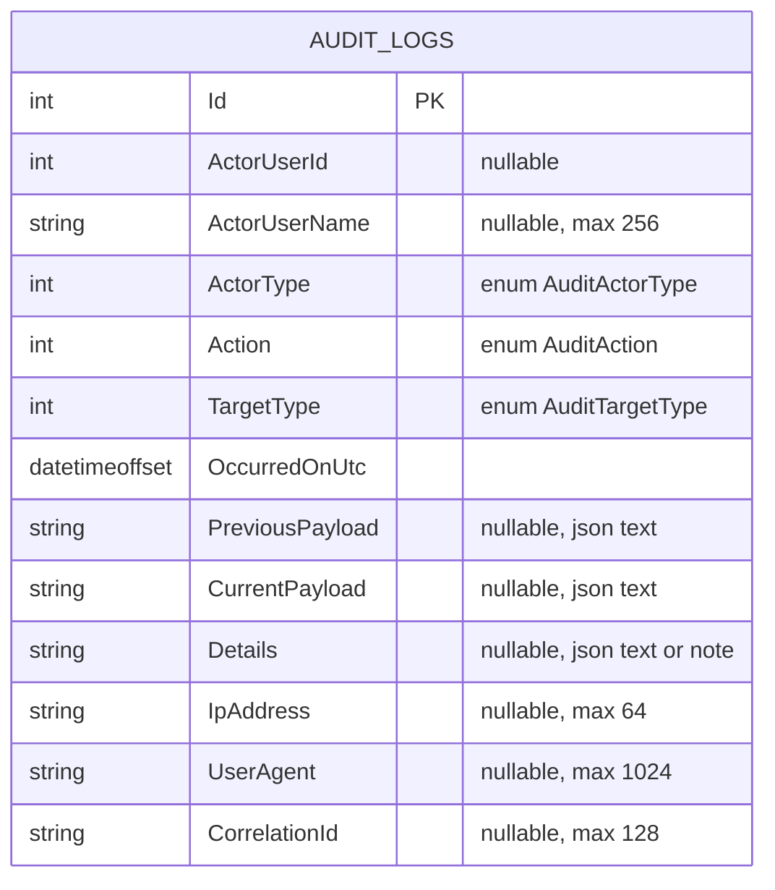

# AC-94 Domain DB Diagram

## Task Identity

- Jira Task: [AC-94](https://nexttoptech.atlassian.net/browse/AC-94)
- Parent Story: [AC-5](https://nexttoptech.atlassian.net/browse/AC-5)
- Repository Target: `projects/accounting-sso`
- Status: pending-tl-approval

## Diagram

## Table

| Column / Change | SQL Shape | Null | Constraint / Index | Reason |
|---|---|---|---|---|
| `Id` | `int identity` | No | PK clustered | Stable persisted identity |
| `ActorUserId` | `int` | Yes | No hard FK recommended | Supports user, system, and service actors without fake references |
| `ActorUserName` | `nvarchar(256)` | Yes | none | Human-readable actor snapshot |
| `ActorType` | `int` | No | enum-backed | Required actor classification |
| `Action` | `int` | No | enum-backed, index candidate with `OccurredOnUtc` | Reusable audit event type |
| `TargetType` | `int` | No | enum-backed | Generic target classification |
| `OccurredOnUtc` | `datetimeoffset` | No | index candidate with `Action` | Required UTC event time |
| `PreviousPayload` | `nvarchar(max)` | Yes | none | Before-state capture for change events |
| `CurrentPayload` | `nvarchar(max)` | Yes | none | After-state capture for change events |
| `Details` | `nvarchar(max)` | Yes | none | Extra contextual audit detail |
| `IpAddress` | `nvarchar(64)` | Yes | optional index only if query needs appear later | Request metadata |
| `UserAgent` | `nvarchar(1024)` | Yes | none | Request metadata |
| `CorrelationId` | `nvarchar(128)` | Yes | non-unique index candidate | Cross-log tracing |
| Remove `TargetUserId` | drop column | n/a | drop old FK and index | Eliminates user-only target coupling |
| Remove `TargetUserName` | drop column | n/a | none | Eliminates user-only target coupling |
| Remove `ActorSubject` | drop column | n/a | none | Replaced by `ActorUserId` / `ActorUserName` / `ActorType` |
| Remove `IX_AuditLogs_TargetUserId` | drop index | n/a | remove | Old index becomes invalid after removing the legacy target field |
| Remove `FK_AuditLogs_Users_TargetUserId` | drop FK | n/a | remove | Prevents stale user dependency in the new generic model |

## Property Descriptions

### `ActorUserId`

Carries the acting user only when the actor is a user. It stays nullable for system and service actors and should not force a user row relationship in the schema.

### `ActorUserName`

Captures an actor name snapshot for readability. It is not a source-of-truth identity key.

### `ActorType`

Persists the actor classification enum so the database can distinguish user, system, and service events without relying on null inference alone.

### `Action`

Persists the generic audit action enum. This should remain reusable across domains rather than encode current workflow names.

### `TargetType`

Persists which domain type was affected. This is the only target-classification field explicitly requested by Jira.

### `OccurredOnUtc`

Stores the event time in UTC to preserve ordering and cross-service consistency.

### `PreviousPayload` and `CurrentPayload`

Store optional before/after serialized payloads so state transitions can be audited without adding entity-specific columns.

### `Details`

Stores auxiliary context when a structured payload is unnecessary or when a compact explanation is useful.

### `IpAddress` and `UserAgent`

Store request metadata for operational traceability and abuse analysis. They remain nullable because not every audit event originates from an HTTP request.

### `CorrelationId`

Stores request or workflow correlation so persisted audit records can be tied back to runtime logs and traces.

### Removed Legacy Columns

`TargetUserId`, `TargetUserName`, and `ActorSubject` must be removed because they encode the legacy assumption that audit records always target a user and always originate from a user subject.

## Source Traceability

| DB Element | Jira Source | Current Schema Anchor | Planned Outcome |
|---|---|---|---|
| New actor columns | Delivers bullets 1, 2, 5; TC-05..TC-08 | `20260428142827_add_audit_log.cs` and current model snapshot | Replace old actor subject/user target assumptions with generic actor metadata |
| New target classification | Delivers bullet 4; AOC-03; DOD-01 | No current target classification column exists | Add `TargetType` to make audit rows reusable across entities |
| New payload columns | Delivers bullet 1; TC-02 | Current schema has only `Details` | Support before/after snapshots without per-entity columns |
| New request metadata columns | Delivers bullets 6, 7; AOC-05; TC-02 | No current request metadata columns | Capture IP, user agent, and correlation context |
| Legacy column removal | Problem statement; AOC-06; TC-09 | `TargetUserId`, `TargetUserName`, `ActorSubject`, old FK/index | Drop deprecated schema elements and stale dependencies |
| Migration validation | AOC-08; DOD-04; TC-03, TC-04, TC-12 | `src/03.Infra/ERP.Sso.Infra.Sql/Migrations/ERP.IDS/` | Produce a reviewable migration that upgrades and rolls back cleanly |