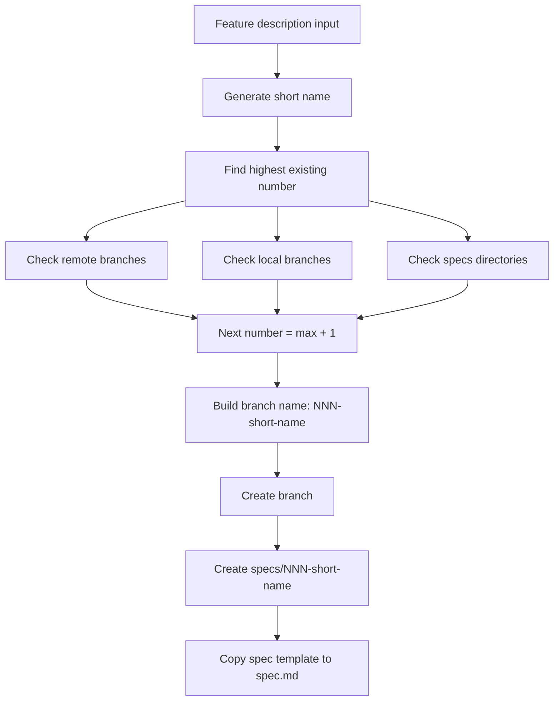

# Specify Branching Template

This document defines the branch naming template and creation flow used by SpecKit scripts.

> Scope note: this template governs SpecKit feature-spec branches (`specs/<branch>/...`) and does not replace delivery Git workflow branches (`features/*`, `story/*`, `sprint/*`, `hotfix/*`) defined in `docs/workflows/git-workflow-flows.md`.

## Branch Naming Pattern

- Required feature branch pattern:
  - `NNN-short-name`
- Examples:
  - `001-user-auth`
  - `024-payment-timeout-fix`

Validation is enforced by common script logic (`Test-FeatureBranch`) and used by prerequisite checks.

## Branch Creation Flow

## Numbering Rules

- The next feature number is determined from the maximum of:
  - existing branch numbers (local + remote)
  - existing `specs/NNN-*` directories
- Numbers are zero-padded to 3 digits.
- If no match exists, numbering starts at `001`.

## Short Name Rules

- Short name is generated from meaningful words in feature description.
- Stop words are removed.
- Output is normalized to lowercase kebab-case.
- The final branch name is truncated if it exceeds branch-length constraints.

## Scripts and Paths

- Feature creation scripts:
  - `.specify/scripts/powershell/create-new-feature.ps1`
  - `.specify/scripts/bash/create-new-feature.sh`
- Shared branch/path logic:
  - `.specify/scripts/powershell/common.ps1`
  - `.specify/scripts/bash/common.sh`
- Feature workspace path template:
  - `specs/<branch>/spec.md`

## Operational Notes

- The script sets `SPECIFY_FEATURE` for the active shell session.
- If Git is unavailable, the script still creates `specs/<branch>` and `spec.md`.
- Branch creation command is expected to run once per new feature request.
