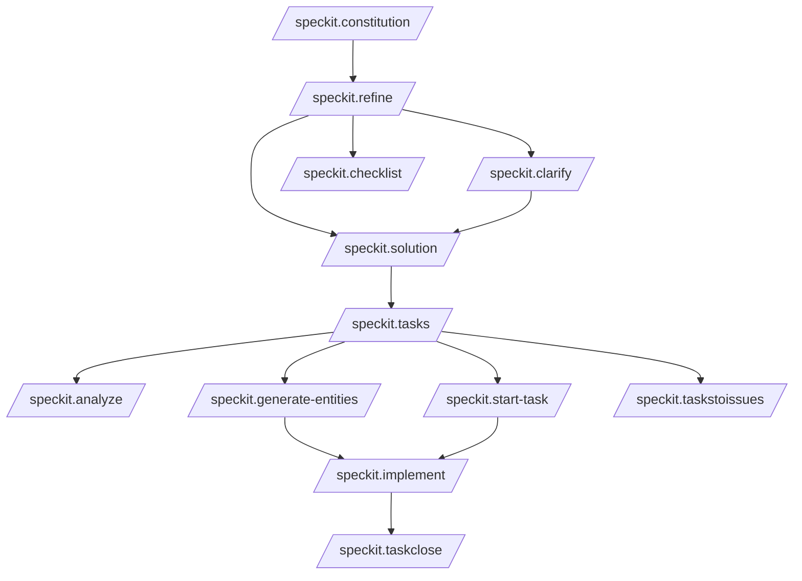
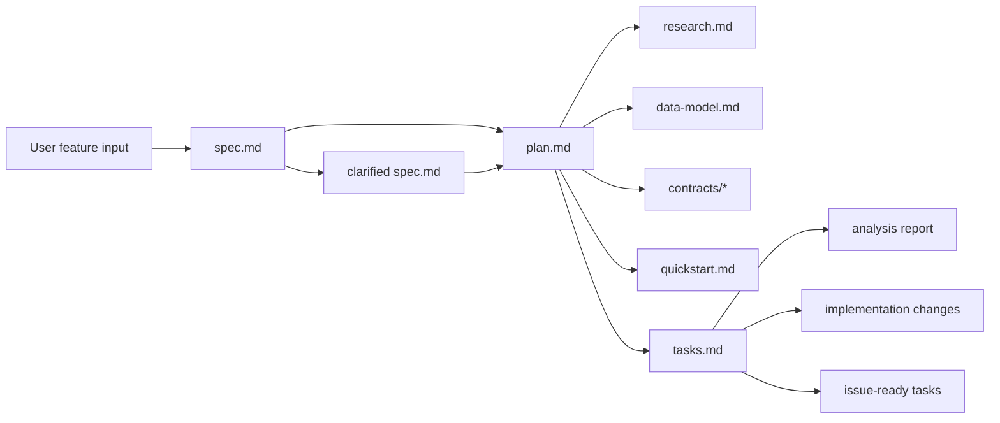

# Specify Codex Flow

This document describes the current SpecKit workflow for Codex based on files in `.codex/prompts` and `.specify/scripts`.

## End-to-End Flow

## Command Responsibilities

- `/speckit.refine`
  - Reads `docs/work-items/00.refinement/README.md` and templates.
  - Fetches Jira story details via API.
  - Generates `docs/work-items/00.refinement/linked/stories/<KEY>/refinement.md`.
  - Generates `docs/work-items/00.refinement/linked/stories/<KEY>/checklists/requirements-checklist.md`.
  - Does NOT create Jira tasks or start solution work.
- `/speckit.clarify`
  - Resolves high-impact ambiguities in refinement.
  - Can hand off to `/speckit.solution`.
- `/speckit.solution`
  - Reads `docs/work-items/01.solution/README.md` and templates.
  - Requires approved `refinement.md` as input.
  - Generates `solution.md`, `task-plan.md`, and optional per-task `tasks/<KEY>.md` detail files.
  - Does NOT create Jira subtasks (that is `/speckit.tasks`).
- `/speckit.tasks`
  - Reads Solution artifacts (`solution.md`, `task-plan.md`).
  - Generates per-task detail files under `docs/work-items/01.solution/linked/stories/<KEY>/tasks/`.
  - Creates Jira subtasks via API under the parent story.
  - Updates task files with real Jira keys.
  - Can hand off to `/speckit.analyze` and `/speckit.start-task`.
- `/speckit.checklist`
  - When story key provided: saves checklist to `docs/work-items/00.refinement/linked/stories/<KEY>/checklists/`.
  - When no story key: saves to `FEATURE_DIR/checklists/` (free-form feature mode).
- `/speckit.start-task`
  - Documentation-first task gate before implementation.
  - Generates either domain-design markdown artifacts or a production-grade implementation plan.
  - Requires explicit repository targeting and executable TDD/BDD plan details.
  - Requires explicit TL approval before implementation can begin.
- `/speckit.analyze`
  - Performs cross-artifact consistency checks.
- `/speckit.implement`
  - Executes the TL-approved implementation plan in the related target repo(s).
  - Delivers real production-ready code with TDD-first execution and BDD acceptance validation.
  - Enforces traceability from AoC/DoD/Test Cases to code and tests.
- `/speckit.taskstoissues`
  - Executes Jira/GitLab task workflow (not only generation).
  - Updates Jira status and performs GitLab operations using loaded tokens.
- `/speckit.taskclose`
  - Documents completed task execution with full references and timestamps.
  - Updates story/standalone execution folders based on GitFlow task type.
  - Updates Postman collection artifacts for API-related tasks.
  - Updates module `README`/`CHANGELOG` when module docs exist.
  - Ensures commit is created after each logical change batch using `wip` prefix/suffix convention.

## Artifact Flow

  ## Task Prompt Operational Contract (Mandatory)

  For every task-oriented prompt execution (especially `/speckit.taskstoissues`):

  1. Load secrets from `.secrets/credentials.local`.
  2. Validate Jira and GitLab credentials before proceeding.
  3. Update Jira task status according to workflow stage (minimum: move to `In Progress` at start).
  4. Perform required GitLab operations via token-authenticated API (issue/MR/branch/linking).
  5. Maintain bi-directional traceability between Jira and GitLab artifacts.
  6. Ensure mandatory Jira metadata is present (`AoC`, `DoD`, `Test Cases`, `Fix Version`, `Epic`, labels).
  7. Enforce MVP Fix Version `V 0.1 (MVP)` for story/task items in this phase.
  8. Ensure GitLab issue exists for each story and standalone task, and connect MR to that issue.
  8.a. Reuse-first policy: if GitLab issue already exists for the Jira task context, reuse it and do not create duplicates.
  8.b. Reuse-first policy: if task MR already exists (workspace or project), reuse it and do not create duplicates.
    8.1. For every Jira task/subtask in GitFlow, create/reuse two task MRs:
      - Workspace MR for workspace/process/task-log artifacts.
      - Project MR for product code changes.
  9. For subtasks, enforce order: create/reuse GitLab issue from the Jira task first, then create/reuse the MR from that task.
  10. For subtasks, GitLab issue derivation must be based on parent Jira key/title and include both parent and subtask Jira links in description.
  11. For subtasks, GitLab MR title must be based on subtask key/summary and MR description must include both parent and subtask Jira links.
  12. Ensure release-level GitLab milestone exists and is used for release artifacts.
  13. Return a summary containing:
     - Jira task URL + status
     - GitLab issue URL
    - Workspace GitLab MR URL
    - Project GitLab MR URL
     - Source branch
     - Target branch

  This workspace uses operational mode by default. Dry-run mode must be explicitly requested.

  ## Task Completion Artifacts (Mandatory)

  Completion prompt outputs are stored in deterministic locations:

  - Story task record: `docs/work-items/implementation/stories/<STORY-KEY>/tasks/<TASK-KEY>.md`
  - Story summary: `docs/work-items/implementation/stories/<STORY-KEY>/story-summary.md`
  - Standalone task record: `docs/work-items/implementation/standalone/<type>/<TASK-KEY>.md`
  - API collection updates: `docs/work-items/implementation/**/postman/*.postman_collection.json`
  - Module docs: `docs/work-items/implementation/**/module/README.md` and `docs/work-items/implementation/**/module/CHANGELOG.md`

  Each task record includes:

  - Start datetime / end datetime
  - Jira info and links
  - Git branch and both MR links/states (workspace + project)
  - Commit references
  - Validation notes and rollback notes

  ## Task Start Artifacts (Mandatory)

  Before implementation coding starts, `/speckit.start-task` must generate markdown artifacts and pass TL approval:

  - Domain Design task:
    - Location: `docs/work-items/00.refienment/JiraStory/<PARENT-STORY-KEY>/domain-design/`
    - Required sections in each markdown artifact:
      - `Table`
      - `Property Descriptions`
      - `Source Traceability`
    - Required artifact set:
      - Domain model summary
      - Domain DB diagram markdown
      - Entity property dictionary
      - Source traceability map
  - Non-domain task:
    - Location: implementation work-items task folder
    - Required artifact: task implementation plan markdown
      - Scope and assumptions
      - Implementation steps and dependencies
      - TDD/BDD verification plan
      - Risks and rollback notes

  ## Commit Policy in Operational Flow

  - Agent should create a commit after each logical change set.
  - Interim commit messages must contain `wip` as prefix or suffix.
  - Suggested patterns:
    - `wip: <scope> - 
`
    - `<scope>: 
 [wip]`
  - Finalization stage may squash or replace `wip` commits per branch promotion policy.

  ## Git Workflow Alignment (v1.2)

  - Branch hierarchy: `main ← stage ← test ← develop ← task branches`.
  - Task development happens under `develop` using `features/*`, `bugs/*`, `technicals/*`.
  - Promotion to `test` is only through `story/*` branches assembled from `develop` commits.
  - Promotion to `stage` is only through `sprint/*` branches.
  - `hotfix/*` starts from `main` and merges directly to `main`.
  - Sync direction follows direct-child rule only.

## Jira Board Status Mapping

- `Backlog` → planning pool (stories start here)
- `To Do` → queued and not started (WIP cap `16` tasks)
- `In Progress` → active implementation (story enters when first task starts)
- `In Review` → technical review and merge stage
- `PO Review` → product acceptance of integrated story output
- `Done` → final approved completion

## Required Execution Rules

- Always run in the current feature branch format: `NNN-short-name` for SpecKit feature planning artifacts.
- All paths are treated as absolute by the scripts.
- `plan.md` is required before task generation.
- `tasks.md` is required before implementation mode.
- `start-task` TL-approved artifacts are required before `implement` mode.
- Implementation plans must be repository-targeted and production-executable (not generic).
- Branch creation and spec bootstrap must run once per feature request.
