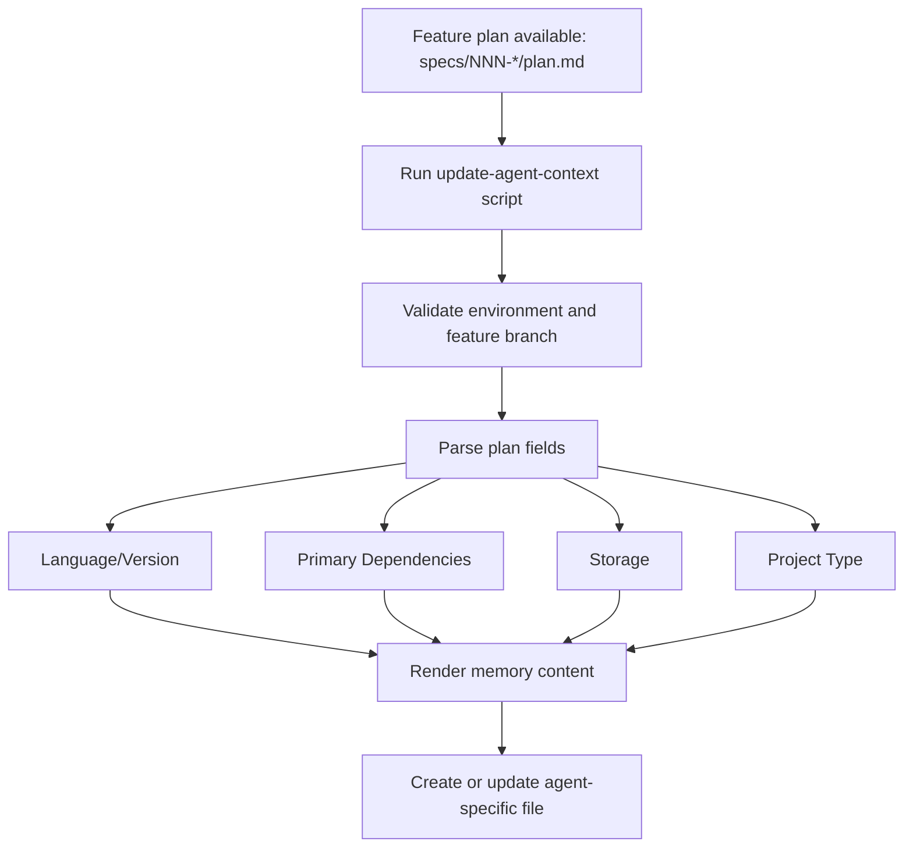

# Specify Memory Flow

This document explains how SpecKit memory/context is generated and maintained from planning artifacts.

## Memory Update Flow

## Source of Truth

- Template files:
  - `.specify/templates/agent-file-template.md`
  - `.specify/memory/constitution.md`
- Runtime input:
  - `specs/<branch>/plan.md`
- Script implementation:
  - `.specify/scripts/powershell/update-agent-context.ps1`
  - `.specify/scripts/bash/update-agent-context.sh`

## Supported Agent Targets

The update script supports multiple targets, including:

- `codex`
- `copilot`
- `claude`
- `gemini`
- `cursor-agent`
- and other configured agent types in script validation.

## Output Behavior

- If target file exists: update generated sections while preserving manual additions between markers.
- If target file does not exist: create from the agent template.
- Generated memory includes:
  - Active technologies
  - Project structure hint
  - Common commands
  - Language conventions
  - Recent feature changes

## Typical Commands

- Update a specific agent context:
  - `./.specify/scripts/powershell/update-agent-context.ps1 codex`
- Update all detected agent files:
  - `./.specify/scripts/powershell/update-agent-context.ps1`
